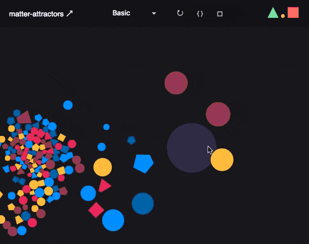

# matter-attractors

> An attractors plugin for [matter.js](https://github.com/liabru/matter-js/)

[](https://travis-ci.org/liabru/matter-attractors)

This plugin makes it easy to apply continual forces on bodies.
It's possible to simulate effects such as wind, 
[gravity](https://en.wikipedia.org/wiki/Newton's_law_of_universal_gravitation) and 
[magnetism](https://en.wikipedia.org/wiki/Magnetism).

## Demo

See the [demo](http://liabru.github.io/matter-attractors).

[](http://liabru.github.io/matter-attractors)

## Install

Get the [matter-attractors.js](build/matter-attractors.js) file directly or get it via npm:

    npm install matter-attractors

### Dependencies

- [matter.js](https://github.com/liabru/matter-js/)

## Usage

```js
Matter.use('matter-attractors');
// or
Matter.use(MatterAttractors);
```

See [Using Plugins](https://github.com/liabru/matter-js/wiki/Using-plugins#using-plugins) for more information.

### Custom attractors

Attractors are just functions that are pushed to `body.plugin.attractors`.
An attractor function accepts two bodies `bodyA` and `bodyB`, where `bodyA` is 
always the attracting body and `bodyB` is the body being attracted.

The attractor will be called against every other body in the engine in the place of `bodyB`,
on every engine update. If a force is returned, it will be applied to `bodyB` only.

#### Basic usage

An example of a body that attracts other bodies to it:

```js
var body = Matter.Bodies.circle(0, 0, 10, {
  plugin: {
    attractors: [
      function(bodyA, bodyB) {
        return {
          x: (bodyA.position.x - bodyB.position.x) * 1e-6,
          y: (bodyA.position.y - bodyB.position.y) * 1e-6,
        };
      }
    ]
  }
);
```

It's possible here to use collision filters too if needed, by using [Detector.canCollide](http://brm.io/matter-js/docs/classes/Detector.html#method_canCollide)
and returning `null` to skip the pair.

#### Advance usage

In advance usage, e.g. where forces apply to both bodies, instead of returning the force it can instead 
be applied manually to both bodies inside the function using `Body.applyForce`.

```js
var body = Matter.Bodies.circle(0, 0, 10, {
  plugin: {
    attractors: [
      function(bodyA, bodyB) {
        var force = {
          x: (bodyA.position.x - bodyB.position.x) * 1e-6,
          y: (bodyA.position.y - bodyB.position.y) * 1e-6,
        };

        // apply force to both bodies
        Body.applyForce(bodyA, bodyA.position, Matter.Vector.neg(force));
        Body.applyForce(bodyB, bodyB.position, force);
      }
    ]
  }
);
```

### Built in attractors

There are some attractors you can push to `body.plugin.attractors`:

- `MatterAttractors.Attractors.gravity` - uses Newton's gravitational laws to apply an attractive force on both bodies

## Documentation

See the [API docs](API.md).

## Examples

Check out the [examples](docs/examples) or try them out first:

- [Basic](http://liabru.github.io/matter-attractors#basic)
- [Gravity](http://liabru.github.io/matter-attractors#gravity)
